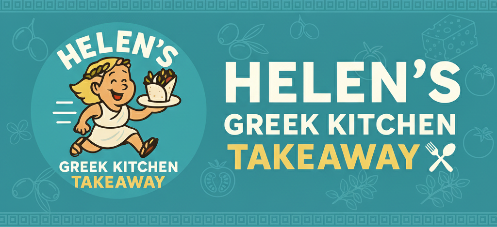

<!DOCTYPE html>
<html lang="en">
<head>
    <meta charset="UTF-8">
    <meta name="viewport" content="width=device-width, initial-scale=1.0">
    <title>Helen's Greek Kitchen - Photo Gallery</title>
    <link href="https://cdnjs.cloudflare.com/ajax/libs/font-awesome/6.4.0/css/all.min.css" rel="stylesheet">
    
</head>
<body>
    <!-- Header -->
    <header class="header">
        
    </header>

    <!-- Navigation -->
    <nav class="navbar">
        

            

                <a class="nav-link" data-target="about">About</a>
                <a class="nav-link" data-target="allergens">Allergens</a>
                <a class="nav-link" data-target="contact">Contact</a>
            

        

    </nav>

    <!-- Main buttons -->
    <section class="main-actions">
        

            <a class="action-button" id="showMenu">
                <i class="fas fa-book" style="margin-right:12px;"></i>View Full Menu
            </a>
            <a href="https://goodeats.io/helensgreek" class="action-button" target="_blank">
                <i class="fas fa-shopping-cart" style="margin-right:12px;"></i>Order Now
            </a>
        

    </section>

    <!-- Category selector -->
    

        &times;
        <h2 class="category-title">Our Menu Categories</h2>
        

            

                <h3>Starters for the Gods</h3>
                
Divine appetizers to begin your feast

            

            

                <h3>Wraps for the Gods</h3>
                
Heavenly pita wraps filled with flavor

            

            

                <h3>Greek Me Baby One More Time</h3>
                
Platters fit for Olympus

            

            

                <h3>The Greek Quests</h3>
                
Traditional Greek main courses

            

            

                <h3>Sweet Treats</h3>
                
Desserts worthy of the gods

            

        

    

    <!-- STARTERS MENU -->
    

        &times;
        

            <h2>Starters for the Gods</h2>
            
Before the main feast, the gods liked to snack too. Sharing is optional. Greed is divine.

        

        

            

                <h3>Allitis Pitta</h3>
                
A homemade Classic from our own Greek Legend Helen. Beef Mince Meat on a pitta bread, served with a little salad and Authentic Greek Yogurt.

            

            

                <h3>Feta Pastry with Honey</h3>
                
Crispy, Salty, Sweet and scandalously addictive. Proof the Gods liked a dessert before dinner. PDO Feta cheese wrapped in filo pastry and drizzled with honey and sesame.

            

            

                <h3>Kolokithokeftedes</h3>
                
Crispy Courgettes fritters bursting with herb and Feta – Zeus himself declared them "dangerously moreish".

            

            

                <h3>Greek Salad</h3>
                
Fresh, Crunchy and very Athenian-approved. Even Plato would pause his philosophy for this. Authentic Greek Salad, fresh tomatoes, cucumber, bell pepper, onions, olives, extra virgin olive-oil and oregano.

            

            

                <h3>Dolmades</h3>
                
Tender vine leaves, stuffed with rice and herbs, basically Greek Sushi but with more Salt. Served with a fresh lemon sauce.

            

            

                <h3>Talagani Cheese</h3>
                
Grilled to golden perfection, crispy outside heavenly inside. Even Apollo could not resist this melody of flavour.

            

            

                <h3>Tzatziki</h3>
                
Cool Authentic Greek Yogurt, cucumber & garlic – Combo of destiny. The shield that protects all gyros.

            

            

                <h3>Aubergine Dip</h3>
                
Smokey, silky and deeply mysterious. If the Oracle of Delphi made Sushi, this would be it!

            

            

                <h3>Houmous</h3>
                
Smooth, Garlicky and made with love (and Chickpeas.) The dip of diplomacy – unites all tables. Served with Extra Virgin Olive Oil and paprika.

            

            

                <h3>Olives</h3>
                
Simple. Classic. Eternal. Athena's proudest invention. Respect the Olive!

            

        

    

    <!-- WRAPS MENU -->
    

        &times;
        

            <h2>Wraps for the Gods</h2>
        

        

            

                <h3>Pork Gyros</h3>
                
Juicy, smoky, and 100% approved by the intellectual Athenians. Yes, Socrates would've ordered two. Served with fries, tomatoes, onions, and Tzatziki.

            

            

                <h3>Chicken Gyros</h3>
                
Tastes like a Greek summer, desired by ancient Spartan warriors. Served with fries, tomatoes, onions, and Tzatziki.

            

            

                <h3>Pork Souvlaki</h3>
                
Tender pork, kissed by fire and Greek spices, wrapped in fluffy pita glory. Served with fries, salad, and divine sauce.

            

            

                <h3>Chicken Souvlaki</h3>
                
Succulent chicken, marinated like a Spartan's secret weapon, grilled to perfection. Wrapped with salad, fries, and legendary sauce.

            

            

                <h3>Kebab Souvlaki</h3>
                
All the juicy, grilled goodness of our kebab, wrapped tighter than Athena's helmet. Sweet red peppers and ambrosia-inspired sauce.

            

            

                <h3>Greek Sausage</h3>
                
Bold, flavorful, and full of street-smart swagger straight from the Greek agora. Herbs so good, even Dionysus would raise his goblet in approval.

            

            

                <h3>Talagani Wrap</h3>
                
Grilled Talagani, peppers, and a drizzle of zesty lemon sauce. Mount Olympus-worthy delight.

            

        

    

    <!-- GREEK ME BABY ONE MORE TIME MENU -->
    

        &times;
        

            <h2>Greek Me Baby One More Time</h2>
            
Platters fit for Olympus - share with your fellow gods or keep it all for yourself

        

        

            

                <h3>Pork Gyros Platter</h3>
                
Feast like a true Olympian with our legendary pork gyros served with fries, salad, pita bread, and Tzatziki.

            

            

                <h3>Chicken Gyros Platter</h3>
                
A heroic portion of our famous chicken gyros, accompanied by fries, fresh salad, warm pita, and authentic Tzatziki.

            

            

                <h3>Mixed Gyros Platter</h3>
                
Can't decide? Have it all! Both pork and chicken gyros with all the trimmings.

            

        

    

    <!-- THE GREEK QUESTS MENU -->
    

        &times;
        

            <h2>The Greek Quests</h2>
            
Traditional Greek main courses that will take you on a culinary journey

        

        

            

                <h3>Moussaka</h3>
                
Layers of eggplant, minced meat, and creamy béchamel sauce - a Greek classic!

            

            

                <h3>Pastitsio</h3>
                
Greek baked pasta with minced meat and béchamel sauce.

            

            

                <h3>Stifado</h3>
                
Traditional Greek beef stew with pearl onions in rich tomato sauce.

            

        

    

    <!-- SWEET TREATS MENU -->
    

        &times;
        

            <h2>Sweet Treats</h2>
            
Desserts worthy of the gods - because even Olympus needs something sweet!

        

        

            

                <h3>Baklava</h3>
                
Layers of crispy filo pastry, nuts and honey syrup.

            

            

                <h3>Galaktoboureko</h3>
                
Creamy custard baked in filo pastry with sweet syrup.

            

            

                <h3>Loukoumades</h3>
                
Golden honey puffs drizzled with cinnamon and walnuts.

            

        

    

    <!-- Photo gallery overlay -->
    

        &times;
        

            <h2 class="gallery-title" id="galleryTitle">Food Name</h2>
            
            
Food description

            

                <button class="gallery-nav-btn" id="prevBtn"><i class="fas fa-chevron-left"></i> Previous</button>
                <button class="gallery-nav-btn" id="nextBtn">Next <i class="fas fa-chevron-right"></i></button>
            

        

    

    <!-- Footer -->
    <footer class="footer">
        

            
&copy; 2025 Helen's Greek Kitchen | The Three Cups Pub

        

    </footer>

    
</body>
</html>
